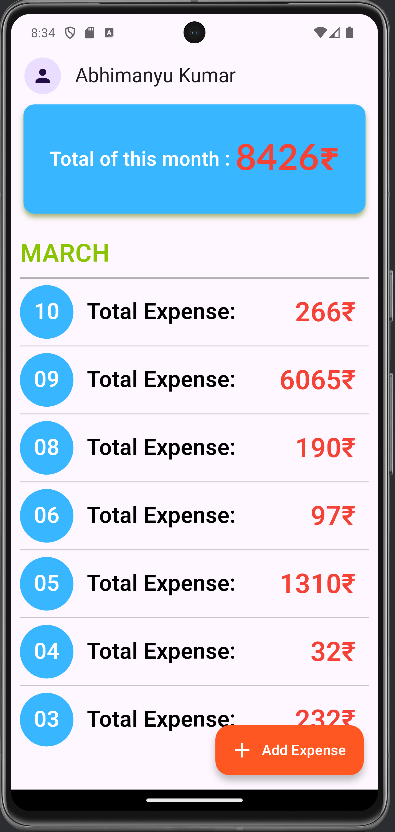
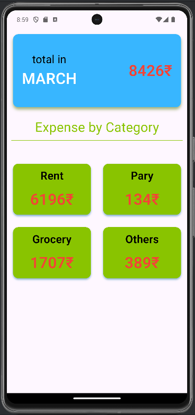
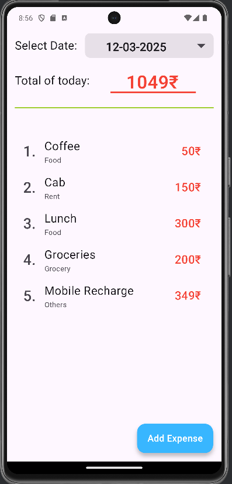
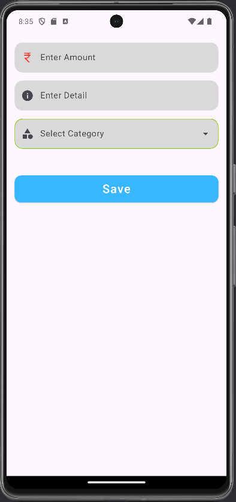

# Kharchabook - Expense Tracker App


Kharchabook is a smart expense tracking app built with **Flutter & Firebase**, designed to help users manage their daily and monthly expenses efficiently. The app provides an intuitive interface to track, categorize, and analyze expenses with ease.

## 🚀 Features

- **Secure Authentication**: Login & Sign-up with Firebase Authentication.
- **Expense Tracking**: View total monthly expenses and daily breakdowns.
- **Category-Wise Expense Analysis**: Visualize spending with categorized insights.
- **Budget Management**: Set and monitor monthly spending limits.
- **Data Sync & Backup**: Uses Firebase Firestore for real-time storage.

## 🛠️ Tech Stack

- **Flutter** – Frontend UI framework
- **Firebase Authentication** – User authentication
- **Cloud Firestore** – Real-time database for storing expenses

## 📸 Screenshots

| Login | Sign Up | Home | Categories | Daily Breakdown | Add Expense |
|-------|--------|------|------------|----------------|------------|
|  |  |  |  |  |  |

## 📂 Installation & Setup

1. Clone the repository:
   ```sh
   git clone https://github.com/yourusername/Kharchabook.git
   ```
2. Navigate to the project directory:
   ```sh
   cd Kharchabook
   ```
3. Install dependencies:
   ```sh
   flutter pub get
   ```
4. Run the app:
   ```sh
   flutter run
   ```

## 💡 Contributing

Contributions are welcome! Feel free to fork the repo, submit issues, or open a pull request.

## 📜 License

This project is licensed under the MIT License.
